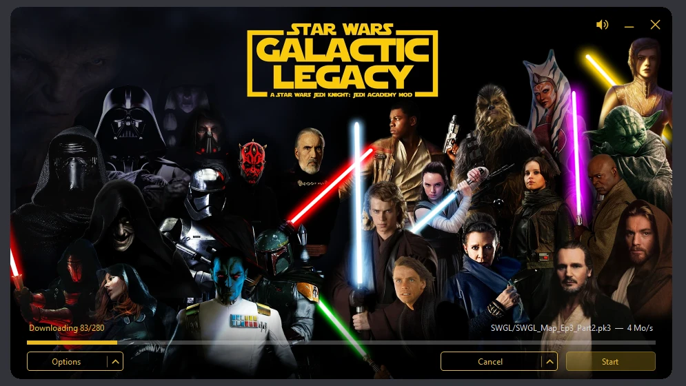

# SWGL Launcher

Launcher and updater for **Star Wars: Galactic Legacy**, a *Jedi Knight: Jedi Academy* mod.

It keeps a player's `GameData` in sync with the mod's file server, over FTPS, on a public
channel or on a private beta channel, then starts the game. It ships as a single executable.



## Features

- **Borderless window** with a configurable background, looping music and a mute button.
- **Public and beta channels.** A tester enters a code; the launcher connects to the matching
  account and installs that build. Switching back to the public release is one click.
- **State-based updates.** A channel is described by a manifest listing every file with its
  size and SHA-256. The launcher makes the installation match it, so the same code path
  installs, repairs, updates, switches channel and rolls back.
- **Resumable downloads,** verified by checksum, written through a temporary file so an
  interrupted transfer never leaves a truncated `.pk3` behind. A transfer cut by the network
  reconnects and resumes on its own, up to three times.
- **Patch notes**: when a channel publishes Markdown notes, a *Patch notes* link appears next
  to the version and opens them in their own window.
- **Log panel** listing every step, download and error — opened with the `»` button, and
  automatically when something fails.
- **Cleanup** of the mod's own files that the channel no longer ships; nothing else in the
  game folder is deleted unless the channel explicitly asks for it.
- **Self-update** from GitHub releases: at startup the launcher installs the latest release
  of itself and restarts.
- **Jedi Outcast asset import**, for the mod's JO-derived missions.
- **Steam integration**: adds the launcher to the Steam library as a non-Steam game, with
  library artwork.

## Requirements

Windows 10 or 11, 64-bit. Nothing else — the .NET runtime is bundled in the executable.

## Installation

Drop the executable and its `SWGL` folder into the game's `GameData` folder, next to
`jasp.exe`:

```
GameData\
├── SWGLLauncher.exe
└── SWGL\
    └── launcher_music.mp3
```

Then run `SWGLLauncher.exe`. On the first update it will download the mod into place.

## Interface

The title bar carries a speaker button — it mutes the music and remembers the choice —
alongside minimise and close. At the top left, `»` opens the log panel and `«` closes it; the
text can be selected and copied.

At the bottom left, **Options** opens upward:

| Entry | What it does |
| --- | --- |
| **Beta channel** | Pick *Public*, a saved beta, add a beta code, or forget one. |
| **Configure Jedi Outcast...** | Import `Assets0/1/2.pk3` from a Jedi Outcast install. |
| **Configure Steam launcher...** | Add the launcher to the Steam library, artwork included. |
| **Check integrity** | Re-check every checksum and report what differs, without downloading. |

When the channel has patch notes, a *Patch notes* link sits at the right end of the status
line; it opens a single window, brought back to the front if clicked again.

At the bottom right, **Update** brings the installation in line with the channel. **Start** launches the game. During an operation *Update* becomes
*Cancel* and *Start* is disabled.

## Configuration

Every setting has a built-in default, so no configuration file is shipped. To override a
value, create `launcher.properties` next to the executable (plain `key=value`) with only the
keys to change; the launcher also writes to it to remember choices made in the interface.
Paths are relative to the executable or absolute; colours are `#RRGGBB` or `#AARRGGBB`.

| Key | Meaning |
| --- | --- |
| `window.title`, `window.width`, `window.height`, `window.corner.radius` | Window. |
| `music.enabled`, `music.loop`, `music.volume` | Music. `music.enabled` is rewritten by the speaker button. |
| `titlebar.*`, `ui.accent.color` | Colours. |
| `sync.enabled`, `sync.check.on.start` | Updates; the check on start downloads nothing. |
| `install.path` | Folder to synchronise. `.` means the launcher's own folder. |
| `state.file` | Local state written by the launcher. |
| `sync.deletable` | The only files the cleanup may delete — see below. |
| `sync.download.retries` | Automatic retries of an interrupted download, each resuming where it stopped. |
| `ftp.host`, `ftp.port`, `ftp.tls`, `ftp.accept.any.certificate`, `ftp.timeout.ms` | Connection. `explicit` means FTPS on port 21. |
| `ftp.noop.interval.ms` | Keeps the control connection alive during long transfers; `0` turns it off. |
| `log.ftp.verbose` | Log every FTP command, not just warnings and errors. Passwords stay masked. |
| `ftp.public.user`, `ftp.public.password` | Public channel account. |
| `ftp.beta.user.prefix` | Beta account is `<prefix><code>`, password is the code. |
| `manifest.file` | Manifest path on the server, same for every channel. |
| `patchnotes.file` | Patch notes path on the server, same for every channel. |
| `game.executable`, `game.arguments`, `game.close.launcher` | The **Start** button. |
| `jo.path`, `steam.*` | Written by the Options menu. |
| `beta.codes`, `channel.selected` | Written by the channel menu. |
| `update.enabled`, `update.repository` | Self-update from the GitHub releases of this repository. |

The background and the Steam artwork are embedded in the executable; the music ships next to
it as `SWGL\launcher_music.mp3`. To replace an image without rebuilding, drop a file next to the
executable — `SWGL\background.png`, `SWGL\cover.png`, `SWGL\wide_cover.jpg`, `SWGL\logo.png`. A file on disk
always wins over the embedded copy, and the cleanup leaves it alone.

## How updating works

Each channel publishes a `manifest.json` at the root of its FTP account:

```json
{
  "channel": "public",
  "version": "21",
  "files": [
    { "path": "SWGL/SWGL_Menu.pk3", "from": "/base/SWGL/SWGL_Menu.pk3", "size": 190532653, "sha256": "..." }
  ]
}
```

`path` is the destination inside `install.path`, `from` is the path on the server. The
manifest describes the **expected end state**, not a sequence of operations — which is what
makes installing, repairing, switching beta and going back to public the same operation.

Checksums are only recomputed when a file's size or timestamp has changed; *Check integrity*
forces a full pass.

### Cleanup

The cleanup only ever deletes files the mod itself publishes, and only when the channel no
longer lists them. `sync.deletable` names them; by default:

| Pattern | Covers |
| --- | --- |
| `base/zzzzzzz_SWGL_JKJO.pk3` | The mod's only file in `base`; nothing else there is ever deleted. |
| `SWGL/SWGL_*.pk3` | The mod's archives. |
| `SWGL/*.dll` | The mod's game modules. |

Everything else in `install.path` is left alone, whatever it is: the stock game, other mods,
saves, configuration, interrupted downloads (`.part`). In `sync.deletable`, `*` stays inside a
folder and `**` crosses folders; entries are separated by commas. The launcher, its
configuration, its state file and any override dropped next to it are never deleted, even if
a pattern matches them.

A file a channel ships outside these patterns stays in place when the channel drops it,
unless the channel forces its deletion: the manifest's `delete` list adds paths or patterns
for that channel, set on the server with `swgl-sync force-delete`. Files the channel still
publishes, and the launcher's own files, are never deleted, whatever the list says.

## Publishing an update

`Tools/SWGLManifest` generates a manifest from a folder. It runs on Windows and on Linux, so
it can run directly on the file server rather than hashing gigabytes across the network.

```bash
# public channel
SWGLManifest --source /srv/swgl/base --source-prefix /base \
             --channel public --version 21 \
             --output /srv/swgl/manifest-public.json

# a beta: its own files win over the shared ones
SWGLManifest --source /srv/swgl/beta-elween --source-prefix /beta-elween \
             --base   /srv/swgl/base       --base-prefix   /base \
             --channel beta-elween --version "Ep3 test 4" \
             --output /srv/swgl/beta-elween/manifest.json
```

`SWGLManifest --help` lists the remaining options (`--notes`, `--exclude`, `--remove-list` to drop shared files from a beta, `--delete-list` to force deletions on players' installs, ...).

Server side, [`server/README.md`](server/README.md) documents the ProFTPD setup: one
read/write publishing account, one read-only public account, one account per beta seeing only
the shared folder and its own build. `server/swgl-sync` creates and removes betas, removes shared files from a given beta, forces the deletion of stray files on players' installs, and regenerates every manifest in one command; `server/swgl-sync-ssh` gives the publishing account a `swgl-sync>` prompt over SSH and nothing else.

## Releasing the launcher

Push a version tag starting with `v` (`v1.2.0`, `v0.2.0-alpha`; a suffix after `-` is ignored when comparing versions); the `Release` workflow builds the launcher with that version and publishes
a GitHub release with `SWGLLauncher.exe` (used by the self-update) and `SWGLLauncher.zip`
(executable and `SWGL` folder, for new installs):

```bash
git tag v0.2.0-alpha
git push origin v0.2.0-alpha
```

At startup, the launcher asks GitHub for the latest release. If its version is higher, it
downloads `SWGLLauncher.exe`, checks its size and the SHA-256 GitHub publishes, renames
itself to `SWGLLauncher.exe.old` — Windows allows renaming a running executable, not
overwriting it — puts the new one in its place and restarts; the new instance deletes the
`.old`. If anything fails, it carries on with the current version and says so in the log.

Only the executable is updated. A local build carries the version of the project file
(`0.2.0-alpha`) and replaces itself with any newer release: set `update.enabled=false` to test one.
Debug builds never update themselves.

## Building from source

Requires the [.NET 10 SDK](https://dotnet.microsoft.com/download). Visual Studio 2026 opens
`SWGLLauncher.slnx` directly.

```bash
dotnet build SWGLLauncher.slnx
dotnet publish SWGLLauncher/SWGLLauncher.csproj -c Release
```

The publish output is the executable plus `SWGL\launcher_music.mp3`, nothing else. Two settings in
the project file make that possible and should not be dropped:
`SatelliteResourceLanguages`, which stops dependencies from creating per-language
subfolders, and `ExcludeFromSingleFile` on `launcher_music.mp3`, without which the bundler swallows it
into the executable.

To build the manifest tool for the server:

```bash
dotnet publish Tools/SWGLManifest/SWGLManifest.csproj -c Release -r linux-x64 \
       --self-contained -p:PublishSingleFile=true -o out-linux
```

## Repository layout

```
.github/workflows/       release workflow (tag v* → GitHub release)
SWGLLauncher/            the launcher (WinForms, .NET 10)
  SWGL/                  artwork (embedded at build time) and music (shipped alongside)
Tools/SWGLManifest/      manifest generator
server/                  ProFTPD, sshd and sudoers configuration, swgl-sync tools
```

## Known limitations

- A `.pk3` is a monolithic zip: changing one texture in an 800 MB file means downloading the
  800 MB again. FTP cannot do deltas. Splitting large `.pk3` files is the only real answer.
- The launcher updates itself from GitHub releases only. A `SWGLLauncher.exe` listed in a
  manifest would fail to be replaced while running.

## Maintainer

Arbiter — [@BE-Arbiter](https://github.com/BE-Arbiter)

## License

GNU General Public License, version 2 — the same licence as OpenJK, from which the mod's
engine derives. See [LICENSE.txt](LICENSE.txt).

## Credits

Artwork — background, library capsules and logo — composed by **Devis** from the game's own
images.

The launcher icon is `swgl-sp.ico`, taken from the OpenJK-SWGL engine. *Star Wars: Galactic
Legacy* belongs to its authors; *Star Wars* is a trademark of Lucasfilm Ltd.

## AI disclaimer

Most of this code was written by Claude Opus 5 under the maintainer's direction, and reviewed
by him. See [AI_DISCLAIMER.md](AI_DISCLAIMER.md) for what was generated, what was tested and
what was not.
